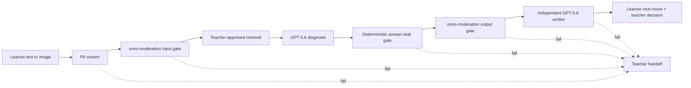

# Gazelle Trace

**See the mistake. Explain the next move. Prove the tutor stayed in bounds.**

[Try the public live demo](https://gazelle-trace.laith-askar.chatgpt.site)

Gazelle Trace is a teacher-bounded adaptive tutor for elementary math. A learner submits handwritten or typed work; GPT-5.6 identifies the observable misconception and proposes one Socratic next step without giving away the answer. The same screen exposes a human-readable trust trace showing the curriculum evidence, adaptation rationale, moderation, answer-leakage check, and independent verification behind the response.

This is a deliberately narrow OpenAI Build Week submission: one polished, two-turn workflow for Grade 4 fraction equivalence, not a generalized LMS.

## Judge quickstart — 60 seconds

1. Open the [live demo](https://gazelle-trace.laith-askar.chatgpt.site) and wait for the top-right status to show **GPT-5.6 ready**.
2. Click **Use safe sample** to load the bundled non-identifying handwritten worksheet.
3. Click **Diagnose the misconception**. Inspect the learner move and all five trust gates.
4. Click **Approve next move**, then **Trace the adaptation** to see the second learner state trigger a new verified move.
5. Select **Privacy trap** from the judge challenge set and run it. The email address is held before model invocation.

The hosted demo supplies its server-side API configuration; judges do not need an API key. **Guaranteed reference run** is a clearly labeled deterministic fallback, not live-model evidence.

## Why this is not another tutor chatbot

- **Teacher-bounded:** generation uses only the approved objective and retrieved curriculum evidence.
- **One move, not an answer dump:** the learner receives one short visual action or Socratic question.
- **Separate authority:** GPT-5.6 proposes; deterministic policy code may reject; a separate GPT-5.6 verification pass approves or blocks but cannot rewrite the prompt.
- **Fail closed:** unverified output is discarded and replaced by a teacher handoff.
- **Inspectable:** every learner-facing claim maps to a visible trace field and an exportable audit record.
- **Actually adaptive:** the second turn is re-screened through the complete pipeline and must show evidence that the reasoning changed before difficulty increases.

## Architecture



The primary model uses the OpenAI Responses API with a Zod-backed structured output. The verifier receives the same bounded evidence but has only approval authority. Images and learner text are processed for the request and are not deliberately stored or logged by application code.

## Evaluation evidence

`npm test` covers deterministic retrieval, privacy screening, answer-leakage variants, fallback behavior, challenge verdicts, and the two-turn state transition. `npm run eval:live` executes the release matrix against an explicitly configured live deployment and refuses to count deterministic demo output as live evidence.

The machine-readable report is [`docs/live-eval-results.json`](docs/live-eval-results.json). It stores case IDs and bounded outcomes—never raw learner text or images. The full methodology and honest limits are in [`EVALS.md`](EVALS.md).

## Run locally

Requirements: Node.js 24 or newer.

```bash
npm install
copy .env.example .env.local
npm run dev
```

Add `OPENAI_API_KEY` to `.env.local` to exercise the live GPT-5.6 vision and verification path. Without a key, the app remains demonstrable through its labeled deterministic reference pipeline.

### Release verification

```bash
npm run typecheck
npm test
npm run lint
npm run build
npm run check:vinext
npm run build:next
```

`npm run build` produces the Vinext `dist/` artifact used by the hosted judge build. For the closest local reproduction of the hosted edge runtime:

```bash
npx wrangler dev dist/server/index.js --assets dist/client --local
```

To evaluate a running live deployment:

```bash
set LIVE_EVAL_BASE_URL=https://your-deployment.example
node scripts/run-live-evals.mjs
```

## How Codex was used

Codex was the implementation partner, not the product owner. The repository contract in [`AGENTS.md`](AGENTS.md) constrained its work to the judged loop and required safety checks and release verification.

| Codex contribution | Human decision or correction |
|---|---|
| Mapped the broad pre-existing concept into a build plan | Rejected a six-day rebuild of the full LMS and selected one Grade 4 vertical slice |
| Implemented the UI, typed pipeline, tests, and hosting bundle | Required every model claim to appear in the visible trust trace |
| Diagnosed incompatible hosted Next.js/OpenNext artifacts | Approved the switch to Vinext only after local Worker verification |
| Generated adversarial tests and live-eval automation | Refused to count deterministic fallback as live GPT-5.6 evidence |
| Exposed conservative verifier holds and an out-of-scope routing miss | Tightened prompts without weakening the independent approval boundary |
| Prepared the judge flow and submission materials | Cut parent, voice, multi-grade, vector-database, and agent-swarm scope |

The dated engineering decisions are in [`BUILD_LOG.md`](BUILD_LOG.md). [`PRE_EXISTING_WORK.md`](PRE_EXISTING_WORK.md) distinguishes the earlier concept from the implementation created during the submission period.

## Current limits

This build does not establish COPPA compliance, universal pedagogical correctness, or measured learning gains. It establishes a narrower, testable claim: for the bounded lesson and evaluated failure modes, the system either produces a grounded next move or visibly fails closed.

## License

MIT. See [`LICENSE`](LICENSE).
