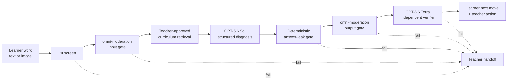

# Architecture

## Why this is not a generic multi-agent system

The primary and verifier calls do not role-play autonomous personas. They have separate authority:

- the primary pass may propose a diagnosis and next move;
- deterministic code may reject answer leakage regardless of model confidence;
- the verifier may approve or reject but cannot rewrite the learner-facing prompt;
- only the fully validated candidate can reach the client.

This separation is easier to evaluate and reason about than marketing three loosely defined “agents.”

## Data boundary

The current vertical slice has no database. Learner text and images live only for the request and are not deliberately logged or persisted by application code. A future production release would require a documented provider-retention configuration, access-control design, deletion workflow, parental/organizational consent flow, and legal review.

